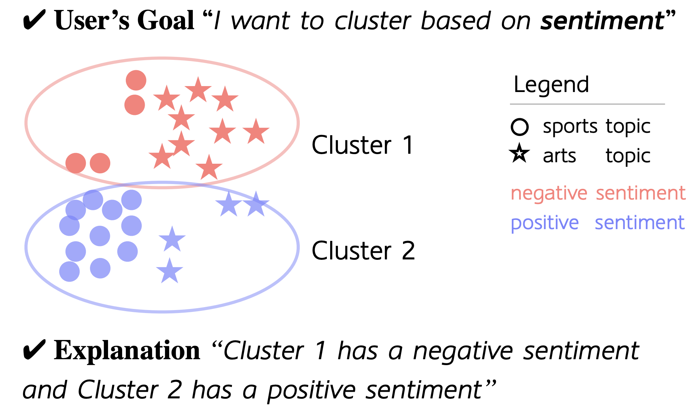
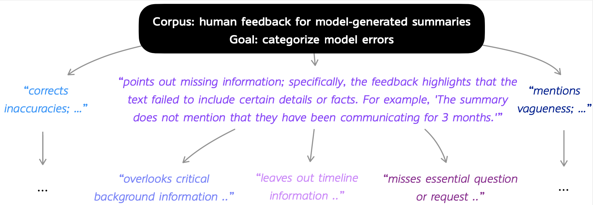

# Goal-Driven Explainable Clustering via Language Descriptions
This repo contains the datasets and the Propose-Assign-Select (PAS) method implementation for the paper [Goal-Driven Explainable Clustering via Language Descriptions](https://arxiv.org/abs/2305.13749).

Authors: Zihan Wang, Jingbo Shang, Ruiqi Zhong

<p align="center"></p>

In Goal-Driven Explainable (GoalEX) clustering, the input is a corpora and a goal to cluster the corpora with. 
The output is a set of clusters, each with a description that matches with the goal.
When applied recursively, GoalEx can [generate an entire taxonomy](#creating-a-hierarchy).


- [Goal-Driven Explainable Clustering via Language Descriptions](#goal-driven-explainable-clustering-via-language-descriptions)
- [Setup](#setup)
- [Dataset](#dataset)
- [PAS](#pas)
  - [Running on a debug dataset](#running-on-a-debug-dataset)
  - [Running on a clustering dataset](#running-on-a-clustering-dataset)
  - [Saving budget](#saving-budget)
  - [Creating a hierarchy](#creating-a-hierarchy)
- [Citation](#citation)

# Setup
We need to install pytorch. Please follow the instructions [here](https://pytorch.org/get-started/locally/). 

Then, install the rest of the dependencies:
```
pip install -r requirements.txt
```

If you need to use openai api's, you will need to get an api key [here](https://beta.openai.com/). 
You will also need to export the api key and organization account in the environment variables:
```
export OPENAI_API_KEY=sk-xx
export OPENAI_ORG=org-xx
```

# Dataset
All datasets in the paper are in `processed_data`. By default, they are a json file (`data.json`) that matches with the fields defined in
`src/cluster_problem.py`, which is
- goal: A natural language goal, such as "I would like to cluster them based on topics; each cluster should have a description of 'has a topic of <something>'"
- texts: A list of strings, each an indiviual text sample in the corpora
- example_descriptions: [Optional] a list of strings, for example, 
  `['has a topic of healthcare', 'has a topic of education']`

Additionally, we provide labels for these problems to evaluate on. The labels (`labels.json`) are in the same folder, with the format
- labels: A list of integers, each an integer label for the corresponding text sample in the corpora
- class_descriptions: A list of strings, each a description of the corresponding class

The format of `processed_data/real_data` is slightly different, please check `src/recursive_cluster.py` for loading it.

# PAS
Here, we show how to use our method, Propose-Assign-Select (PAS), for solving this task.
You can specify an `exp_dir` as an argument to it and the results will be saved in `exp_dir/cluster_result.json`. 

In most cases we use a flan-t5 model as the assigner, so it is reccomended to have a GPU.

## Running on a debug dataset
You will need to have set up the openai api key and organization account in the set up step.
The GPU memory required for the flan-t5-xl assigner is around 20GB.  
To test the code, we provide a debug dataset `processed_data/debug`. You can run the following command:
```
python src/iterative_cluster.py \
  --data_path processed_data/debug \
  --exp_dir experiments/debug \
  --proposer_model gpt-3.5-turbo \
  --assigner_name google/flan-t5-xl \
  --proposer_num_descriptions_to_propose 10 \
  --cluster_num_clusters 6 \
  --verbose
```

## Running on a clustering dataset
Here is also a list of recommended proposers and assigners:
- Proposers: gpt-3.5-turbo, gpt-4
- Assigners: google/flan-t5-xl, gpt-3.5-turbo

We will estimate the query cost if using openai proposer and assigners, before starting the algorithm.
For an example, let's test on the AG's News dataset.
```
python src/iterative_cluster.py \
  --data_path processed_data/agnews \
  --exp_dir experiments/agnews \
  --subsample 1024 \
  --proposer_model gpt-3.5-turbo \
  --assigner_name google/flan-t5-xl \
  --proposer_num_descriptions_to_propose 30 \
  --assigner_for_final_assignment_template templates/t5_multi_assigner_one_output.txt \
  --cluster_num_clusters 4 \
  --verbose
```
You can add `--with_labels` to automatically calculate the performance between the generated clusters and the ground truth labels.

## Saving budget
1. We recommend using a subsample of the dataset to save budget.
2. Experiment with a FlanT5 assigner, and only use a GPT-3.5-turbo assigner if the proposed descriptions are good, but the found clusters are subpar.

## Creating a hierarchy

<p align="center"></p>
We can generate a taxonomy of model errors for human feedbacks of model-generated summaries, as shown in the figure above.

Our code supports creating a hierarchy of clusters by recursively applying the PAS. By default,
we use a gpt-3.5-turbo proposer and gpt-3.5-turbo assigner, and a search for a 2-level hierarchy, with 8 clusters at each node.  
**IMPORTANT** We turn off asking for approval for the recursive clustering, so please be mindful of the cost when using this feature.

As an example with the datasets we expeirmented in the paper, run
```
python src/recursive_cluster.py
```


# Citation
Please cite our paper if you find this repo useful:

```
@article{wang2023goal,
  title={Goal-Driven Explainable Clustering via Language Descriptions},
  author={Wang, Zihan and Shang, Jingbo and Zhong, Ruiqi},
  journal={arXiv preprint arXiv:2305.13749},
  year={2023}
}
